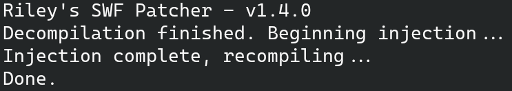
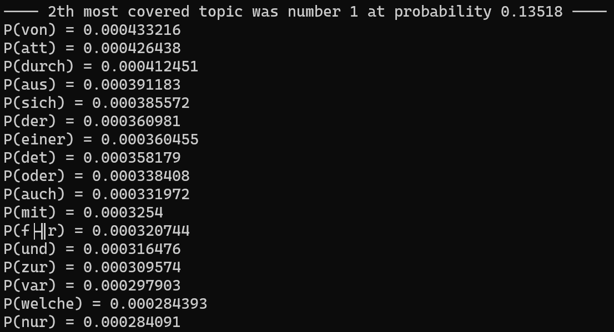
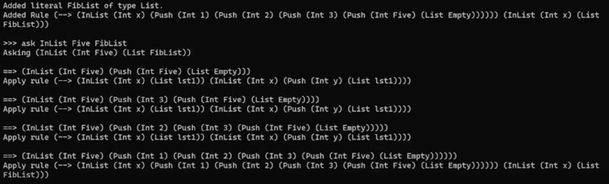
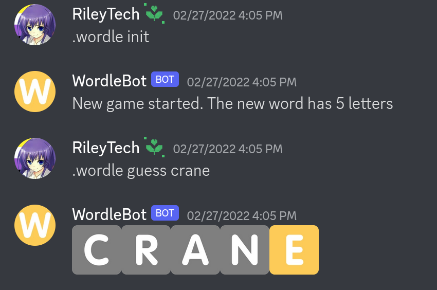

# Coding Projects

You can find the vast majority of my coding projects on my [GitHub](https://github.com/rayyaw). Here are the ones I'm most proud of and/or use most frequently.

## Flash Patching Utility

This utility uses the simple Patchfile language to allow you to inject arbitrary ActionScript code into .swf files. [Source code, instructions, and download.](https://github.com/rayyaw/flash-patcher)

## Robust CNN training

I have done a significant amount of work on training machine learning models that are robust to noise, especially in the domain of computer vision. View the [Jupyter Notebook](https://github.com/rayyaw/robust-cnn/blob/main/adversarial_training_project.ipynb), which contains both the code and results of some of my analyses.

## APLSA

APLSA is an accelerated version of the [PLSA](https://en.wikipedia.org/wiki/Probabilistic_latent_semantic_analysis) machine learning algorithm, implemented for topic mining. My version uses C++ with OpenCL for GPU acceleration. View the [source code and instructions](https://github.com/rayyaw/plsa-gpu).

## RiLab

RiLab is a CPU multithreaded theorem proving software. [Download the latest release here](https://github.com/rayyaw/RiLab/releases), or view the [source code](https://github.com/rayyaw/RiLab).

## Wordle Discord Bot

This Discord bot uses short-term memory in order to play Wordle, but is otherwise stateless. If you're interested in self-hosting this application, you can view the [source code and instructions](https://github.com/rayyaw/wordle-bot).

## Minecraft Computer

I have built a [working computer](https://github.com/rayyaw/minecraft-mips-cpu) in Minecraft: Bedrock Edition, based off of the MIPS ISA. This computer runs at about 0.04 Hz, with an instruction memory of 256 B and a register file of 252 B.

## Miscellaneous Utilities

[This GitHub page](https://github.com/rayyaw/utils) contains various utilities, and may be updated if I make new ones. As of the making of this website, you can find the following:

- Randomized music selection from local .mp3 files
- Recursive line counting utility, which is handy when your code is split across multiple files
