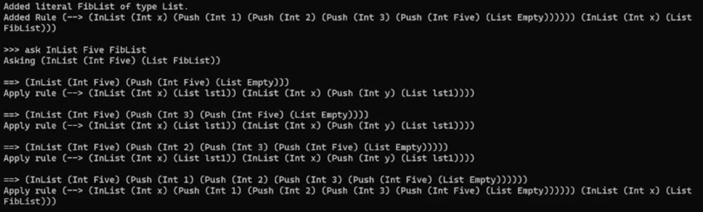
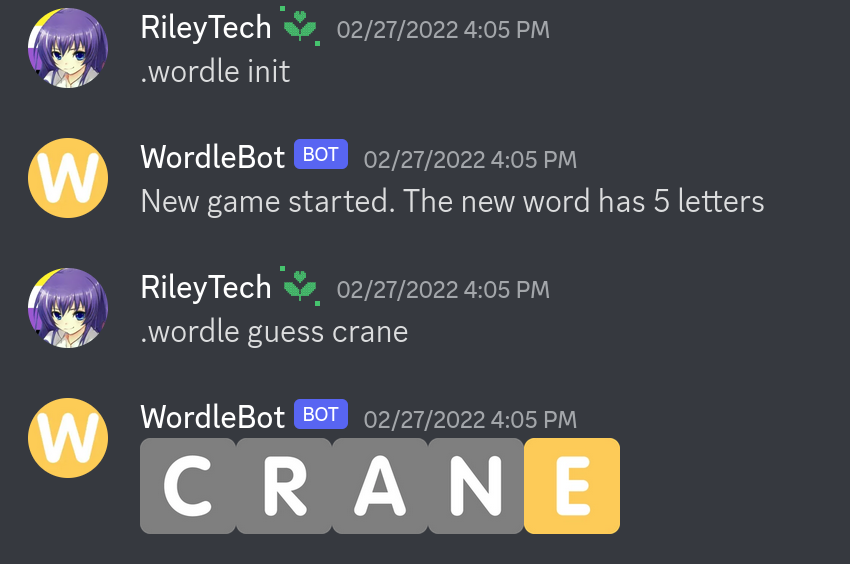
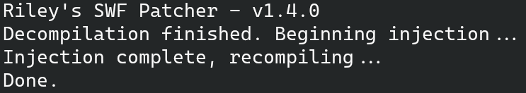

# Coding Projects

You can find the vast majority of my coding projects on my [GitHub](https://github.com/rayyaw). Here are the ones I'm most proud of and/or use most frequently.

## RiLab

RiLab is a CPU multithreaded theorem proving software. [Download the latest release here](https://github.com/rayyaw/RiLab/releases), or view the [source code](https://github.com/rayyaw/RiLab).

## Wordle Discord Bot

This Discord bot uses short-term memory in order to play Wordle, but is otherwise stateless. If you're interested in self-hosting this application, you can view the [source code and instructions](https://github.com/rayyaw/wordle-bot).

## Minecraft Computer

<iframe width="560" height="315" src="https://www.youtube.com/embed/dDbrtulcTWE" title="YouTube video player" frameborder="0" allow="accelerometer; autoplay; clipboard-write; encrypted-media; gyroscope; picture-in-picture; web-share" allowfullscreen></iframe>

I have built a [working computer](https://github.com/rayyaw/minecraft-mips-cpu) in Minecraft: Bedrock Edition, based off of the MIPS ISA. This computer runs at about 0.04 Hz, with an instruction memory of 256 B and a register file of 252 B.

## Flash Patching Utility

This utility uses the simple Patchfile language to allow you to inject arbitrary ActionScript code into .swf files. [Source code, instructions, and download.](https://github.com/rayyaw/flash-patcher)

**Disclaimer:** I am not responsible for malicious or illegal use of Flash Patcher. This utility is designed **solely for non-harmful extensions** of SWF files, such as adding savestates or in-game time for Flash games. Please make sure you have the required rights to the content before making any modifications.

## Miscellaneous Utilities

[This GitHub page](https://github.com/rayyaw/utils) contains various utilities, and may be updated if I make new ones. As of the making of this website, you can find the following:

- Randomized music selection from local .mp3 files
- Recursive line counting utility, which is handy when your code is split across multiple files

## Upcoming projects

While I can't make any promises as to project content or release date, I plan to write some OpenCL applications in the near future in order to get a better handle on GPU acceleration and code optimization.

## Licensing

Unless otherwise specified, the source code *and* binaries for my coding projects have all rights reserved. Most of my projects are Creative Commons licensed. To locate licensing information for a specific project, check the README file on the GitHub page.

If you wish to use any of my projects for purposes that exceed the posted license, please email me at [rayyawspeedruns@gmail.com](mailto:rayyawspeedruns@gmail.com). If you require an urgent response, please message me on Discord at RileyTech#9909.
