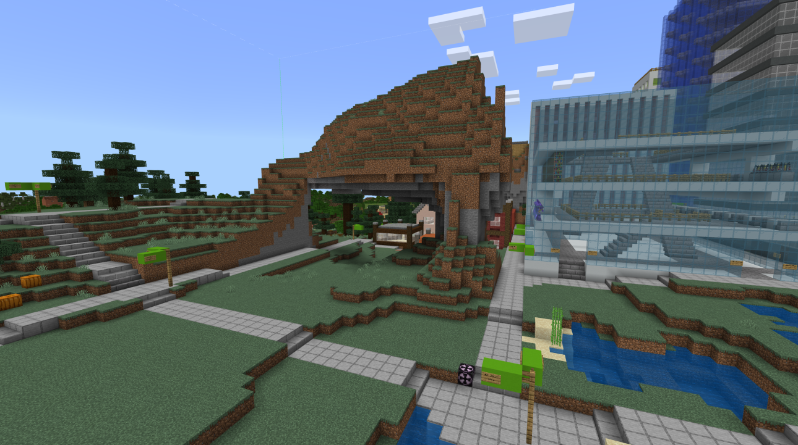
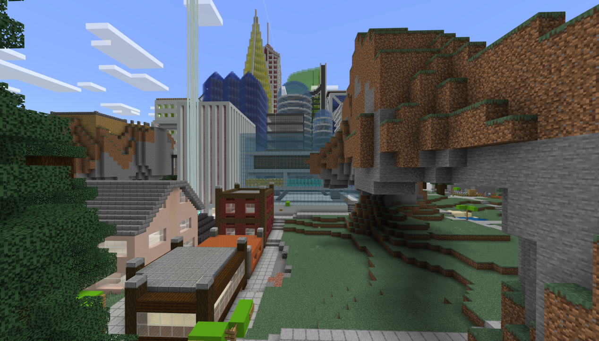
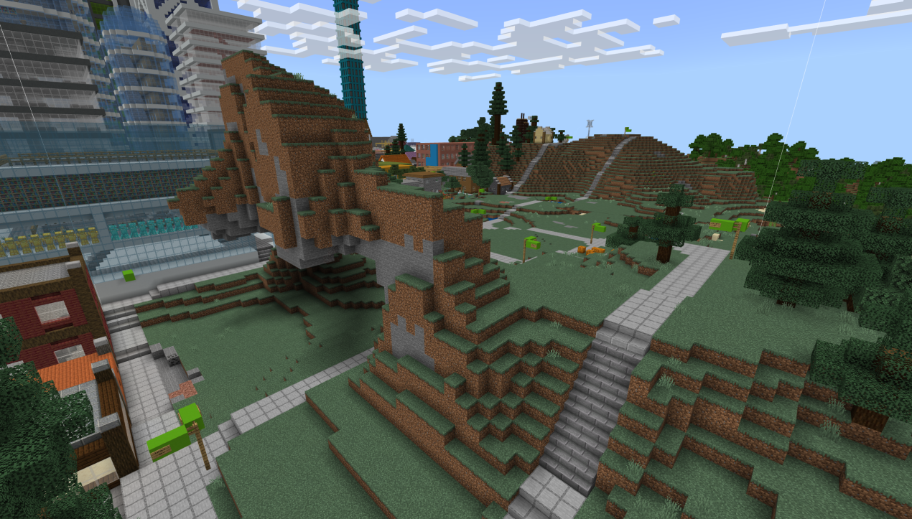
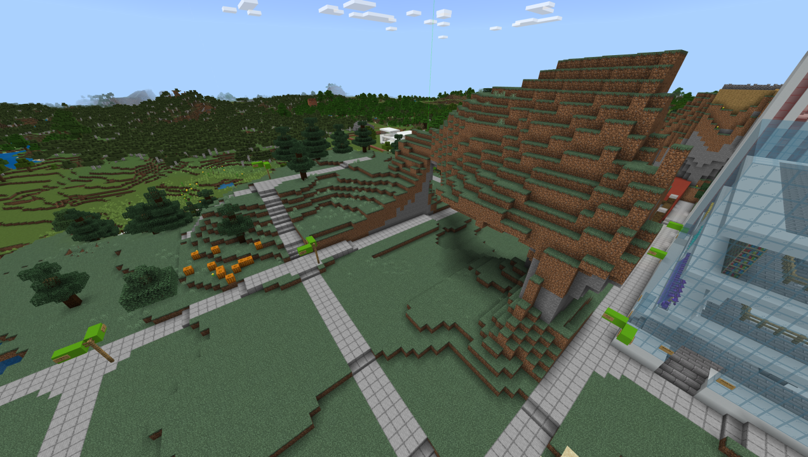

# Riley's Minecraft Build Challenge

## Background

My main Minecraft creative world, and especially the main city of Tonerville, has grown drastically since it was created over 10 years ago, and the expansion has only accelerated in the past 6 months. However, I'm running out of ideas to expand the city, so this is where you come in. The arch shown above is in the city blocks between Research Ave. (850 N) and Cliff St. (1000 N), and West Side St. (300 W) and Tunnel St. (100 W). It was naturally generated when the world first loaded, and I want to develop it into a true landmark within Tonerville.

## Guidelines

You must integrate the arch and the area below it into the city of Tonerville. You may not change the layout of any of the streets, with the exception of Portal St. (925 N, the street that goes through the arch). The arch sits right directly north of the North Bank business district, as shown in the screenshot below.

You should not consider the arch as part of the North Bank district, meaning that you can develop it however you like. You should keep in mind that the arch is the tallest natural point of the city, but any buildings on top of the arch shouldn't be *too* tall (ie, not skyscraper tall). The areas to the north, east, and west of the arch will likely be developed into mid- to low-rise housing (3-4 floors, mid-sized buildings), so you may want to stick to this theme (although this isn't a requirement, you may develop the area into anything you'd like!). You can find a view of these areas in the screenshots below.

The screenshot above is the area west of the arch.

The screenshot above shows the area north of the arch.

**Important Note:** You should not develop the arch into a public park, as Tonerville already has several public parks. You may put a park (or anything else) on top of the arch, but the area below it and next to it should be developed with construction.

## How do I participate?

You should download the [Minecraft structure file](files/minecraftBuildChallenge/The_Arch.mcstructure) and import it into a Creative world. The file was generated on Minecraft Bedrock.

Your final submission should be a .mcstructure file that works on Minecraft Bedrock, with the same X and Z dimensions as the original. You may use unlimited height in your build. If you have hidden/secret areas in your build, you should also submit a quick .txt file explaining how to access the secret areas.

The submission deadline is **March 31st, 2023**. You should submit by DM'ing me the structure file on Discord.

## Evaluation Method

I will score all submissions out of 10 myself. As of now, I don't have strict evaluation criteria, but you should consider the following:

- Did you retain the basic structure of the arch? Does it still look natural?
- Exterior design of any buildings, including potential arch modifications
- Interior design of any buildings, including any spaces potentially inside the arch
- How the area looks compared to the surroundings

## Prizes

All top entries for the competition will be featured in a video on my YouTube channel. The winning entry may be added to my Minecraft creative world. You will also receive the Artist badge on my Twitch page, the VIP badge in my discord, and 3 free months of Tier 1 subscription to my Twitch channel. If the entry is added to my Creative world, I'll also place some signs crediting you next to the build.

## Contact

For further details or additional screenshots, you should DM me on discord.

## Legal

By submitting a file to me, you agree that your submission will be licensed under CC-BY SA 4.0. This allows me to reuse your work for any purposes as long as I credit you. I'm also allowed to modify your work in any way, as long as I reshare under the same license. For more information, see the [Creative Commons website](https://creativecommons.org/licenses/by-sa/4.0/).
